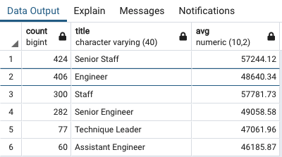
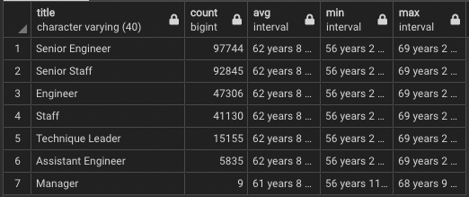
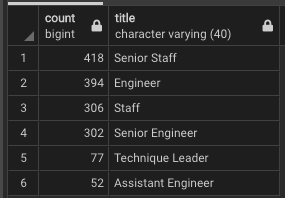

# Pewlett-Hackard Analysis

## Overview of Project
### Purpose
- The purpose of this project was to analyze how many employees are on the verge of retiring from Pewlett-Hackard (P-H). We found this number by looking at current employees' date of births to find who was eligible for retirement (born between January 1, 1952 and December 31, 1955). Additionally, we used the company data to find how many employees were eligible to become part of the mentorship program to help train up the next generation at P-H.

## Results
- P-H as a total of 90,398 employees that fall within the retirement age range (January 1, 1952 and December 31, 1955).
- The Unique Titles table shows that P-H has mostly senior staff members that fall within retirement age. The title with the Highest retirement amount is Senior Engineer with 29414 which is followed by Senior Staff at 28254.
- Additionally, P-H is has a total of 45,397 employees with Engineer in their title (Senior Engineer, Engineer, and Assistant Engineer) who are eligible to retire.
- Lastly, there are only 1,549 employees who are eligible to join the mentorhsip program.

## Summmary

How many roles will need to be filled as the "silver tsunami" begins to make an impact?
- In total, the company will need to fill 90,398 roles as the "silver tsunami" starts to make an impact.

Are there enough qualified, retirement-ready employees in the departments to mentor the next generation of Pewlett Hackard employees?
- The answer to this question depends on a lot of factors that we do not have the data for. The Mentorship program has 1,549 employees who are eligible to join. However, eligibility does not equate to interest. P-H will need to survey eligible employees to gauge interest and get a rough estimate of how many Mentors there will be. Additionally, the employees.cvs file only has employees born in 1965 or before. So we do not know how many younger employees are currently at the company. These younger employees, born after 1965, will make up the majority of the mentees and are the ones fueling the demand for mentors. Therefore, it is difficult to determine how many mentors are needed. In order to answer this question, I would work with P-H to get data to answer the following questions:
1. How many P-H employees were born after 1965 and what are their titles?
2. How many younger employees are interested being a mentee / having a mentor?
3. How many eligible employees are interesting in becoming a mentor?
4. What is the desired mentor to mentee ratio?

### Additional Tables and Queries
I have created a few additional tables/queries to give P-H more context for creating the mentorship program.

1. The first is a table showing the average salary of employees eligible for the mentor program. Earlier, the Sales team was talking about asking retiring staff members to come back as part time mentors. Having the average salary by position for eligible mentors will aid P-H in determining fair pay for these part time mentors should they choose to pursue the Sales team's plan. 
 
2. The second is a table showing the average, minimum, and maximum age for current employees grouped by title. This data will help P-H further plan for the future by seeing the age statistics for each position. 
 
3. Lastly is a table showing the title count for employees eligible for the mentor program. This data will show the break down of mentors by positions to see if it follows the same trend as the count of retiring titles.
